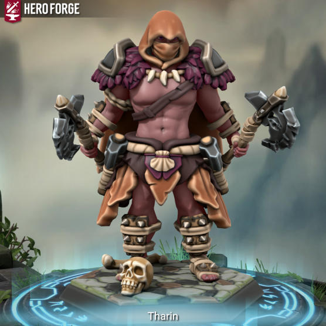

# Tharin

**The following is from the notes of** [Thomas Vic](../../Player%20Characters/Thomas%20Vic.md):

_"Wherever Tharin goes, all NPCs hear is boss music (https://youtu.be/Aqk7x\_w1H98). Tharin is one of our intrepid heroes, though only a fool would consider him a person or even a humanoid. The truth is Tharin is more of an embodiment of war, an individual that even the great_ [Seko Shura](../../NPCs/Carthian/Seko%20Shura.md) _looked upon and saw his potential for combat. Tharin joined the party in_ [Navlaan](../../Locations/Carthus/Navlaan) _though he originally hails from_ [Gromack](../../Locations/Carthus/Gromack.md) _where he underwent the Ritual of Blood to become a Blood-Orc, a creature who lives to hunt the_ [The Corruption](../../Misc/The%20Corruption.md)_. Since the ritual, Tharin is thought to be half-orc and half-elven. Tharin aspires to be the greatest warrior the world has ever seen, trying to master the wielding of two handed weapons in only a single hand he studies under Seko Shura and_ [_Khalisteth_](../../NPCs/Carthian/Khalisteth.md)_. From Shura he learns unbridled strength, the ability to cut entire buildings in half with a single strike at the cost of damage to himself. From Khalisteth he learns an insatiable thirst for battle, the ability to devour his opponents blood in order to fuel his abilities and even heal._  
_When our heroes visited Gromack, Tharin engaged a giant in single combat. Upon its defeat, he was accepted into the inner layers of Gromack and the upper-echelons of the blood clans. Shaman’s awarded him with a tattoo, a vision and a quest. Now_ [_Hellig_](../../NPCs/Patrons/Hellig%20(Mr%20Grim).md) _had better watch out because Tharin’s looking for death, hunting the world’s strongest foes."_  
 

**The following is from the notes of** [Juno Whitfoot](../../Player%20Characters/Juno%20Whitfoot.md):

_“This fucker is terrifying. Note to self: **do not anger this p